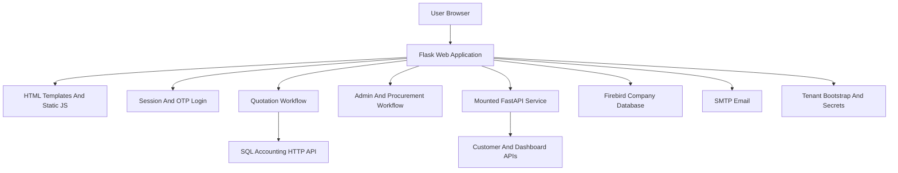
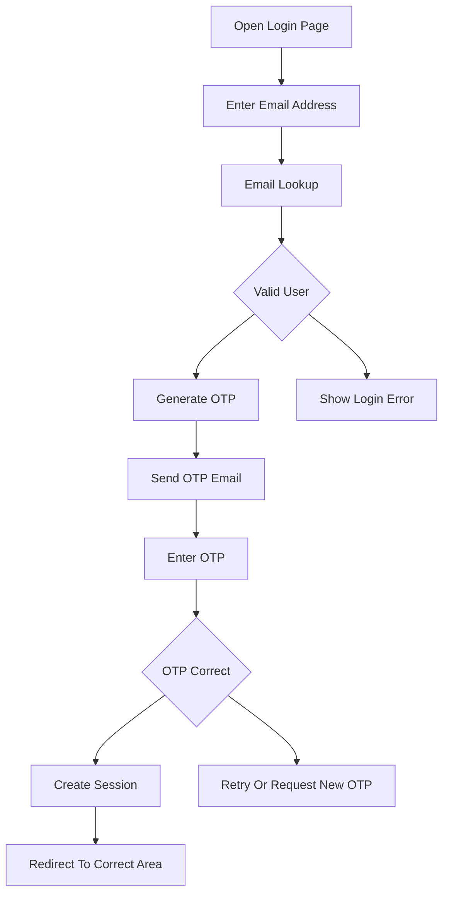
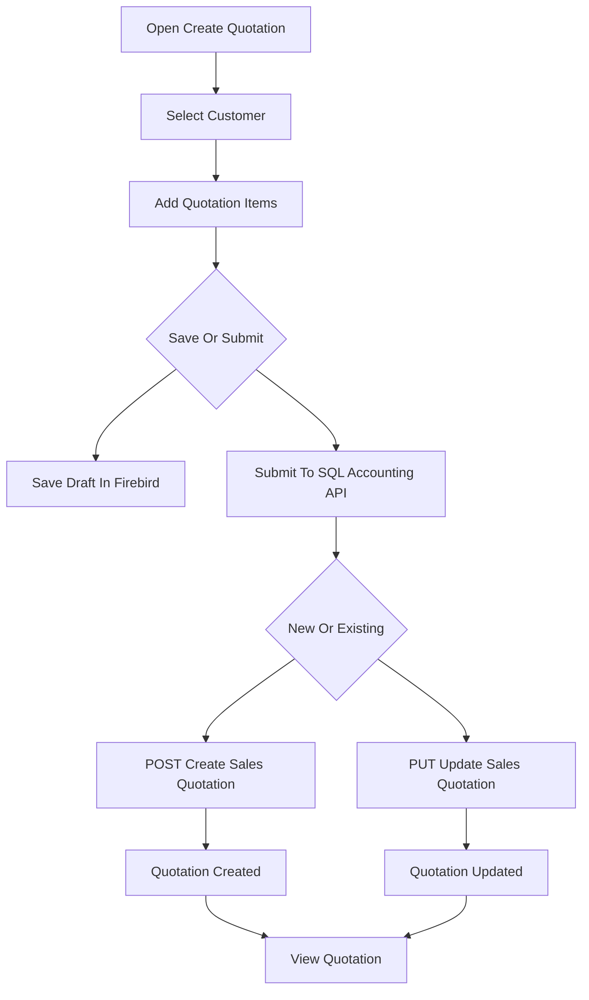
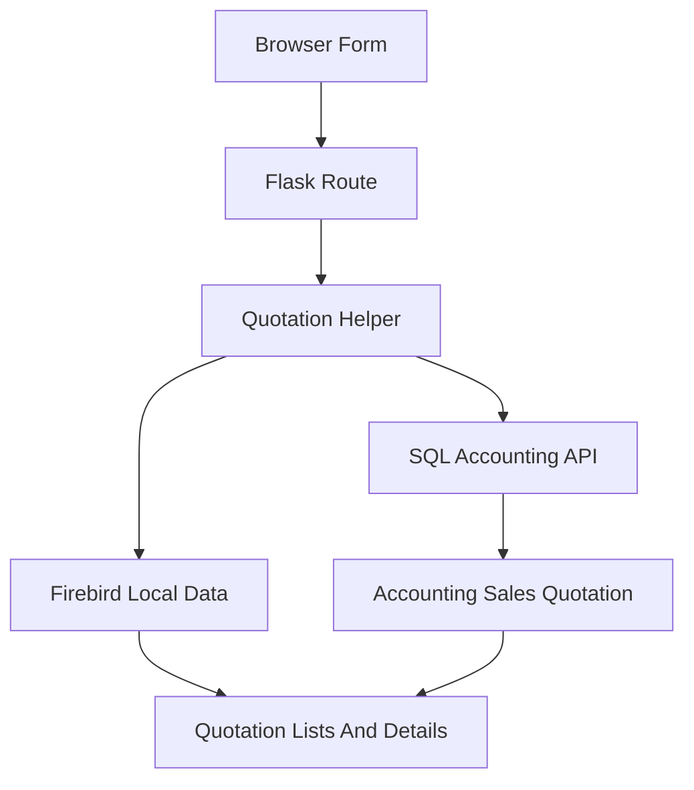

# eQuotation Enterprise Documentation

# ProAcc eQuotation System

Document type: Enterprise system documentation

Project path: C:\Users\sqlsupport\eQuotation

Application type: Python Flask web application with mounted FastAPI service

Primary users: Customers, sales staff, sales management, purchasing staff, suppliers, administrators, and support team

Primary purpose: Manage customer quotation requests, quotation drafts, SQL Accounting quotation submission, quotation updates, customer onboarding, order approvals, procurement workflows, supplier bidding, chat assisted ordering, email notifications, and operational dashboards.

# 1. Introduction

## 1.1 Purpose

The eQuotation system is a web based quotation and business workflow platform. It allows customers and staff to create quotations, save quotation drafts, submit quotations to SQL Accounting, update existing quotations, send email notifications, manage approvals, view dashboards, and handle procurement or supplier bidding workflows.

The system is designed to act as a bridge between user friendly web screens and the company accounting system. Users work inside the eQuotation web portal, while important business records such as customers, quotations, stock items, sales documents, purchase requests, and supplier information are read from or synchronized with the company database and SQL Accounting API.

## 1.2 Business Objective

The main business objective is to simplify quotation and order related operations.

The system helps the company:

1. Allow customers or staff to prepare quotations from a browser.

2. Keep quotation drafts before final submission.

3. Submit approved quotation data into SQL Accounting.

4. Update existing SQL Accounting quotations when business changes happen.

5. Send quotation related email notifications.

6. Support management review through admin screens and dashboard reports.

7. Support purchasing and procurement workflows where required.

8. Support supplier bidding workflows for procurement activities.

## 1.3 Documentation Scope

This document covers the eQuotation project located at C:\Users\sqlsupport\eQuotation.

It explains the project from both business and technical support viewpoints. It includes the system purpose, user roles, main workflows, quotation lifecycle, API surface, data stores, SQL Accounting API integration, configuration, deployment, security, and support notes.

# 2. System Overview

## 2.1 High Level Summary

eQuotation is built mainly as a Flask web application. It serves HTML pages, handles user sessions, manages OTP login, and exposes many JSON API routes for the browser.

The project also includes a FastAPI application. In the current application pattern, FastAPI can be mounted under the Flask application using a path such as /eq-sql-api. It can also run separately in older split server mode.

The system works with Firebird database tables used by SQL Accounting and also communicates with an external SQL Accounting HTTP API using signed requests.

## 2.2 Main Modules

| Module Area | Purpose |
|---|---|
| Flask main app | Main web pages, sessions, OTP login, quotation routes, admin routes, procurement routes, chat routes |
| FastAPI service | Customer APIs, auth lookup, dashboard APIs, supplier APIs, purchase request APIs, health checks |
| Firebird database | Main company data source for customers, quotations, stock, staff, orders, procurement, and logs |
| SQL Accounting API | External API used to create and update accounting records such as sales quotations |
| Email service | Sends OTP and quotation notification emails |
| Tenant bootstrap | Loads tenant database, API, SMTP, and secret settings when configured |
| OpenAI chat | Supports chat assisted workflows when enabled |
| PHP bridge | Supports legacy order related endpoints in selected deployments |

## 2.3 High Level Architecture

## 2.4 Technology Summary

| Area | Technology |
|---|---|
| Main web framework | Flask |
| Companion API framework | FastAPI |
| Runtime server | Uvicorn and Flask integration |
| Main language | Python |
| Database driver | fdb for Firebird |
| Main database | Firebird company database |
| External accounting API | SQL Accounting HTTP API |
| API signing | AWS Signature Version 4 style signing |
| Email | SMTP through configured email settings |
| Templates | Jinja2 HTML templates |
| Frontend assets | JavaScript and CSS under static folder |
| Cloud secrets | AWS Secrets Manager when tenant bootstrap is used |
| AI integration | OpenAI when configured |

# 3. User Roles And Access

## 3.1 Customer

Customers can log in and access quotation related screens. A customer can create quotations, save drafts, submit quotations, and view their own quotation records depending on account configuration.

Customer access is normally restricted to their own customer code or related company information.

## 3.2 Sales Staff

Sales staff can work with quotation creation and quotation viewing. They may prepare quotation data, review quotation information, and assist customers with quotation preparation.

Depending on their configured access tier, some actions may be read only or restricted.

## 3.3 Sales Management

Sales management users have broader access to sales related screens. They may view quotation lists, update quotation records, review statuses, and access dashboard style reports.

## 3.4 Full Admin

Full admin users can access the admin dashboard and wider management functions. These may include admin quotation view, quotation update, quotation cancellation, pricing rules, reports, procurement screens, and other administrative workflows.

## 3.5 Purchasing Staff And Purchasing Management

Purchasing users normally focus on procurement and purchase request workflows. Their access may be directed away from sales quotation screens and toward procurement screens.

## 3.6 Supplier

Supplier users can access supplier bidding screens when the bidding workflow is enabled. Supplier access is used for RFQ or bidding related activities.

## 3.7 Role Summary

| Role | Main Area |
|---|---|
| Customer | Create quotation and view own quotations |
| Sales Staff | Assist with sales quotation workflow |
| Sales Management | Review and manage sales quotations |
| Full Admin | Admin dashboard, quotation management, reports, procurement |
| Purchasing Staff | Purchase request and procurement tasks |
| Purchasing Management | Procurement management and approvals |
| Supplier | Supplier bidding portal |

# 4. Authentication And Session Flow

## 4.1 Login Method

The system uses email OTP login.

Users enter their email address. The system checks the email against customer, staff, admin, or supplier lookup logic. If the email is valid, a one time password is generated and sent to the email address.

After the OTP is verified, the system stores login information in the Flask session.

## 4.2 Session Information

The session may store:

1. User email.

2. User type.

3. Access tier.

4. Customer code.

5. Supplier code where applicable.

6. Staff related information.

7. Department or matched email metadata used in quotation creation.

## 4.3 Login Flow Diagram

## 4.4 Access Control Notes

Page and API access is controlled by session information and role checks. Sales users, purchasing users, customers, and suppliers can be redirected to different areas depending on their access tier.

The system should be maintained carefully because incorrect role configuration may show the wrong screens to the wrong user group.

# 5. Quotation Workflow

## 5.1 Quotation Creation

Quotation creation is one of the main workflows in the system.

A user creates a quotation by selecting customer information and quotation line items. The system prepares a sales quotation payload and submits it to SQL Accounting through the configured API.

## 5.2 Draft Quotation

Users can save quotation drafts before final submission.

Drafts are useful when a quotation is not ready to submit immediately. Draft records are stored locally in Firebird draft tables and can be loaded again later.

## 5.3 Quotation Submission

When a quotation is submitted, the system sends the quotation data to the SQL Accounting API.

For a new quotation, the system uses a create operation. The system allocates or prepares the document number and submits the quotation header and detail lines.

## 5.4 Quotation Update

When an existing quotation is updated, the system uses the quotation document key.

The update flow reads existing quotation header information from Firebird, including update count where needed. The system then sends a PUT request to the SQL Accounting sales quotation endpoint.

This behavior is important because updates should modify the existing SQL Accounting quotation instead of creating a new duplicate quotation.

## 5.5 Admin Quotation Update

Admin users can open an existing quotation through the admin update screen.

The admin update route resolves the customer code from the existing quotation and then submits the update through the same quotation API helper. The system may also send a quotation ready email to the customer if an email address is available.

## 5.6 Quotation Workflow Diagram

## 5.7 Quotation Related Routes

| Route | Purpose |
|---|---|
| /create-quotation | Create quotation page |
| /view-quotation | Customer or user quotation list |
| /admin/view-quotations | Admin quotation list |
| /admin/update-quotation | Admin quotation update page |
| /api/create_quotation | Create or update quotation API |
| /api/save_draft_quotation | Save draft quotation |
| /api/get_my_quotations | Get own quotations |
| /api/get_quotation_details | Get quotation detail |
| /api/admin/update_quotation | Admin update quotation |
| /api/send_quotation_email | Send quotation email notification |

# 6. Admin, Order, Procurement, And Supplier Workflows

## 6.1 Admin Dashboard

Admin users can access the admin dashboard. The dashboard provides a management view of quotation, customer, order, approval, and report related information depending on enabled modules.

## 6.2 Order Approval Workflow

The system includes approval screens for order related workflows.

Admin users may review pending approvals. User approval screens are also available where users can review their own approval related records.

## 6.3 Procurement Workflow

The procurement module supports purchase request and procurement related work. It is used by purchasing staff or purchasing management users.

Procurement workflows can include viewing requests, creating requests, reviewing procurement records, and transferring approved items to purchasing documents depending on configuration.

## 6.4 Supplier Bidding Workflow

Supplier bidding screens support RFQ or bidding activities.

Admin users can manage bidding from the admin side, while supplier users can access supplier bidding pages.

## 6.5 Chat Assisted Workflow

The system includes chat related routes and OpenAI integration. This can support guided order or inquiry workflows when configured.

Chat features depend on OpenAI settings and database tables used for chat sessions and chat details.

## 6.6 Workflow Summary

| Workflow | Main Users | Purpose |
|---|---|---|
| Admin Dashboard | Admin and management | Review business activity |
| Pending Approvals | Admin and users | Review and approve order related records |
| Procurement | Purchasing users | Manage purchase request and procurement activity |
| Supplier Bidding | Admin and suppliers | Handle supplier bid submissions and awards |
| Chat | Logged in users | Assist order or inquiry workflow |

# 7. Data And Database Overview

## 7.1 Main Database

The main database used by the system is Firebird. It contains SQL Accounting aligned business data such as customers, stock items, sales quotations, purchase requests, suppliers, and related transaction records.

The system uses raw SQL through the Firebird driver rather than a large ORM model.

## 7.2 Main Data Areas

| Data Area | Tables Or Objects | Purpose |
|---|---|---|
| Customers | AR_CUSTOMER, AR_CUSTOMERBRANCH | Customer master data |
| Live Quotations | SL_QT, SL_QTDTL | Official sales quotation records |
| Quotation Drafts | SL_QTDRAFT, SL_QTDTLDRAFT | Draft quotation records before submission |
| Stock And Services | ST_ITEM, ST_ITEM_UOM | Item and UOM data used in quotation lines |
| Chat | CHAT_TPL, CHAT_TPLDTL | Chat session and message records |
| Orders | ORDER_TPL, ORDER_TPLDTL | Chat or order workflow records |
| Procurement | PH_PQ, PH_PQDTL | Purchase request related records |
| Sales Cycle | SL_IV, ST_XTRANS and related records | Dashboard and conversion reporting |
| Pricing Rules | PricingPriorityRule | Pricing priority configuration |

## 7.3 Database Initialization

The project includes database initialization logic. This helps create or update application specific database structures when the application starts.

Examples include quotation status fields, draft quotation tables, pricing priority rules, and other supporting structures.

Support teams should understand that startup may perform database checks or initialization tasks.

## 7.4 Data Flow Diagram

# 8. API And Integration Overview

## 8.1 Flask API Surface

The Flask application exposes many JSON routes used by the browser.

Major Flask API groups include:

| API Group | Example Routes | Purpose |
|---|---|---|
| Authentication | /api/send_otp, /api/verify_otp | Login and OTP verification |
| Customer Signup | /api/create_signin_user | Guest or customer onboarding |
| Quotation | /api/create_quotation, /api/save_draft_quotation | Quotation create, update, and draft |
| Admin Quotation | /api/admin/get_all_quotations, /api/admin/update_quotation | Admin quotation management |
| Email | /api/send_quotation_email | Quotation notification emails |
| Chat | /chat, /get_chats, /api/insert_chat | Chat related workflow |
| Procurement | /api/admin/procurement/... | Purchase request and procurement |
| Dashboard | /api/admin/...summary | Reports and analytics |

## 8.2 FastAPI Surface

FastAPI provides supporting API routes, especially for customer, auth lookup, dashboard, suppliers, and purchase request operations.

Depending on deployment, FastAPI may be available under /eq-sql-api.

Examples:

| FastAPI Area | Purpose |
|---|---|
| /health | Health check |
| /auth/email-lookup | User email lookup for login |
| /customers | Customer create or list operations |
| /local/customers | Local Firebird customer operations |
| /dashboard | Dashboard metrics |
| /suppliers | Supplier lookup |
| /purchase_requests | Purchase request APIs |

## 8.3 SQL Accounting API Integration

The system integrates with SQL Accounting HTTP API for important operations.

For quotations:

1. New quotation uses POST to the sales quotation endpoint.

2. Existing quotation update uses PUT with the quotation document key.

3. The system prepares a full quotation payload with header and detail lines.

4. The system uses signed HTTP requests based on configured SQL API credentials.

5. If a timeout happens, support should verify whether the quotation succeeded in SQL Accounting before retrying.

## 8.4 External Integration Summary

| Integration | Purpose |
|---|---|
| SQL Accounting API | Create and update accounting records |
| Firebird Database | Main company data source |
| SMTP Email | OTP and quotation emails |
| AWS Tenant Bootstrap | Load tenant database, API, and secret settings |
| AWS Secrets Manager | Store sensitive credentials where configured |
| OpenAI | Chat assisted workflows |
| PHP Bridge | Legacy order endpoints in selected deployments |

# 9. Configuration, Deployment, And Operations

## 9.1 Configuration Sources

The system can load configuration from several places.

| Source | Purpose |
|---|---|
| appsettings.json | Default project configuration |
| appsettings.Local.json | Local override configuration |
| .env | Environment values and secrets |
| Tenant Bootstrap API | Tenant specific database and API values |
| AWS Secrets Manager | Secure secret values when configured |

## 9.2 Important Configuration Areas

| Area | Example Settings |
|---|---|
| Flask Runtime | FLASK_HOST, FLASK_PORT, FLASK_SECRET_KEY |
| FastAPI Runtime | API_HOST, API_PORT, EQ_SQL_API_MOUNT_PATH |
| Firebird Database | DB_HOST, DB_PATH, DB_USER, DB_PASSWORD |
| SQL Accounting API | SQL_API_HOST, SQL_API_ACCESS_KEY, SQL_API_SECRET_KEY |
| Email | SMTP host, port, user, password, sender |
| Tenant | TENANT_CODE, TenantBootstrap settings |
| OpenAI | OPENAI_API_KEY, OPENAI_MODEL |

## 9.3 Deployment Patterns

The project supports more than one deployment pattern.

| Pattern | Description |
|---|---|
| Unified Server | Flask and FastAPI run together on one port, FastAPI mounted under a path such as /eq-sql-api |
| Split Server | Flask and FastAPI run as separate services or ports |
| Nginx Reverse Proxy | Nginx routes browser, FastAPI, and optional PHP traffic |
| Windows Service | Python application runs as a Windows service |

## 9.4 Production Checks

Before production use, confirm:

1. Flask server starts correctly.

2. FastAPI health check works.

3. Firebird connection works.

4. SQL Accounting API credentials work.

5. OTP email can be received.

6. Customer lookup works.

7. Quotation create works.

8. Quotation update works using PUT.

9. PDF or receipt output works where applicable.

10. Database backup process is confirmed.

# 10. Security, Support, And Maintenance

## 10.1 Security Notes

The system handles customer data, quotation data, staff login, supplier data, and accounting integration credentials.

Security areas to maintain:

1. Flask secret key must be strong and environment specific.

2. SQL API keys must not be exposed publicly.

3. SMTP passwords should be stored securely.

4. OTP codes should not be shared.

5. FastAPI docs should not be publicly exposed in production unless intended.

6. Debug payload logging should be disabled in production.

7. API access keys should be rotated when needed.

8. User roles should be reviewed regularly.

## 10.2 Common Support Issues

| Issue | Support Check |
|---|---|
| User cannot log in | Check email registration and OTP email |
| OTP not received | Check SMTP settings and spam folder |
| Customer not found | Check customer data in Firebird or SQL Accounting API |
| Quotation cannot submit | Check SQL API credentials, payload, item codes, and customer code |
| Quotation update creates issue | Confirm dockey, updatecount, and PUT endpoint behavior |
| Draft missing | Check draft tables and user/customer context |
| Email not sent | Check SMTP credentials and template data |
| Procurement page issue | Check user role and procurement data |
| Supplier bidding issue | Check supplier account and bidding configuration |
| Dashboard empty | Check database connectivity and data availability |

## 10.3 Operational Maintenance

Regular maintenance should include:

1. Confirm database backups.

2. Confirm SQL Accounting API access.

3. Confirm email sending.

4. Review failed quotation submissions.

5. Review timeout cases before retrying.

6. Check tenant bootstrap configuration.

7. Keep staff and customer email records updated.

8. Review user role access.

9. Disable debug logging in production.

10. Confirm Windows service or hosting process restarts correctly.

## 10.4 Recommended Future Enhancements

| Enhancement | Benefit |
|---|---|
| Stronger centralized role management | Easier access control maintenance |
| Shared OTP storage | Better support for multi instance hosting |
| More automated tests | Safer future changes |
| Quotation PDF export | Clearer customer document output directly from portal |
| Admin audit screen | Easier tracking of quotation changes |
| Better retry reconciliation screen | Safer handling of SQL API timeout cases |
| API documentation hardening | Clearer support for integration users |
| Production security checklist | Easier deployment handover |

## 10.5 Final Summary

eQuotation is a business web application that connects customer and staff quotation workflows with the company database and SQL Accounting API.

Its most important areas are login and role access, quotation draft and submit flow, SQL Accounting quotation update behavior, customer data, email delivery, procurement workflows, and deployment configuration.

The system should be maintained with careful attention to database connectivity, API credentials, email settings, user access, and production security controls.

## 10.6 Document Control

| Item | Value |
|---|---|
| Document Owner | Company support and development team |
| Document Level | Enterprise system documentation |
| System | eQuotation |
| Project Path | C:\Users\sqlsupport\eQuotation |
| Status | Ready for internal review |
