# ProAcc eQuotation User Guide

---

## Sign in (all roles)

1. Open the eQuotation login page.
2. Choose account type on the left: **Customer**, **Admin / staff**, or **Supplier**.
3. Enter your email and click **Continue**.
4. Enter the 6-digit OTP from your email and click **Verify**.
5. You are taken to the home screen for your role.

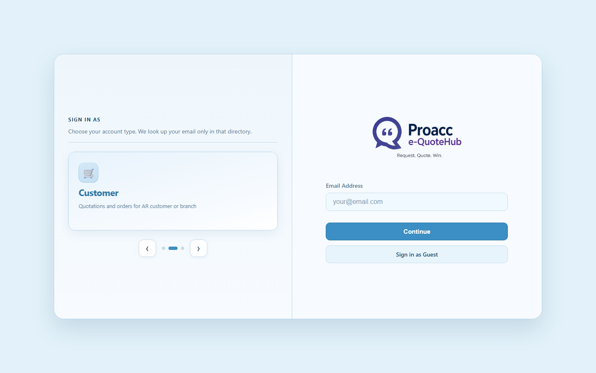

### Guest sign-in

1. On the login page, click **Sign in as Guest**.
2. Register or request access (no OTP).

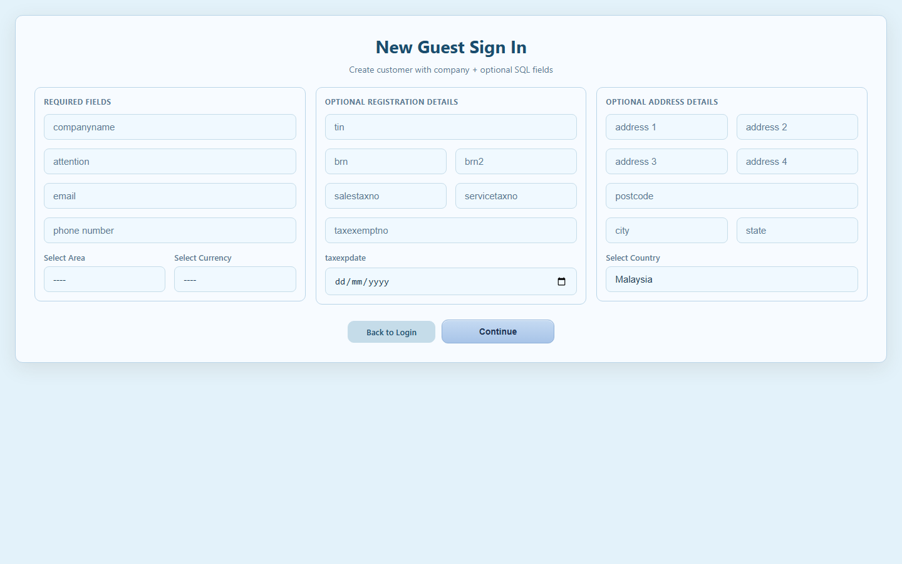

---

## Customer

### Create a quotation

1. Sign in as **Customer**.
2. Open **Quotation > Create Quotation**.
3. Confirm your customer details.
4. Add line items (product, qty, price, discount, delivery date).
5. Click **+ Add Item** for more lines if needed.
6. Click **Save Draft** or **Submit Quotation**.

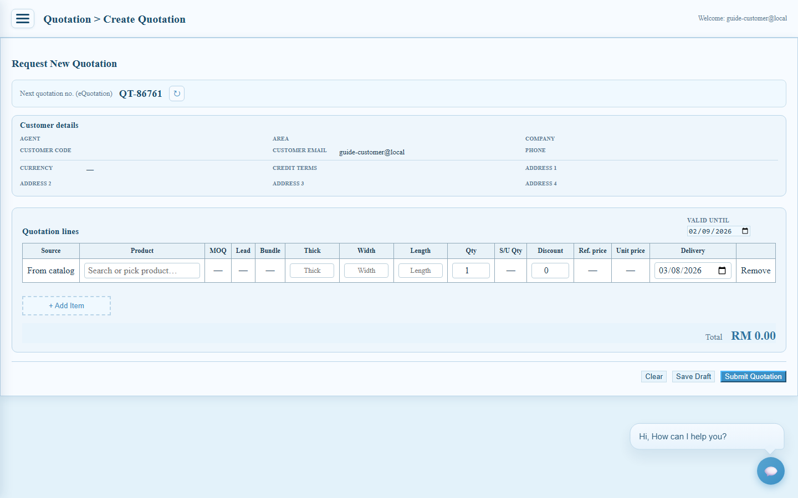

### View my quotations

1. Open **Quotation > View Quotation**.
2. Choose a tab: **Drafts**, **Pending**, **Reviewed**, or **Cancelled**.
3. Click a quotation on the left to see details on the right.

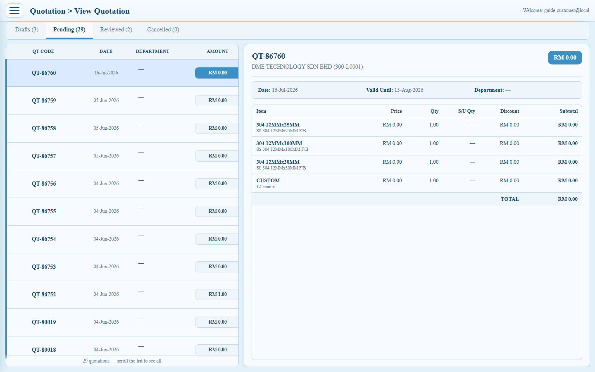

---

## Supplier

### Bidding

1. Sign in as **Supplier**.
2. Open **Supplier > Bidding**.
3. Filter invitations: **Open**, **Submitted**, **Accepted**, or **Closed**.
4. Click an invitation on the left.
5. Enter prices for each line and submit the bid.
6. Use **Refresh** to reload, or **Sign out** when done.

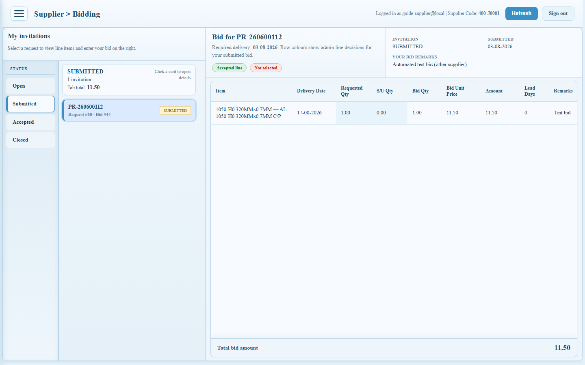

---

## Admin / staff

### Dashboard

1. Sign in as **Admin / staff**.
2. Open **Admin > Dashboard**.
3. Review summary cards (customer status, sales cycle, conversion).
4. Use the menu to open quotations, procurement, approvals, or reports.

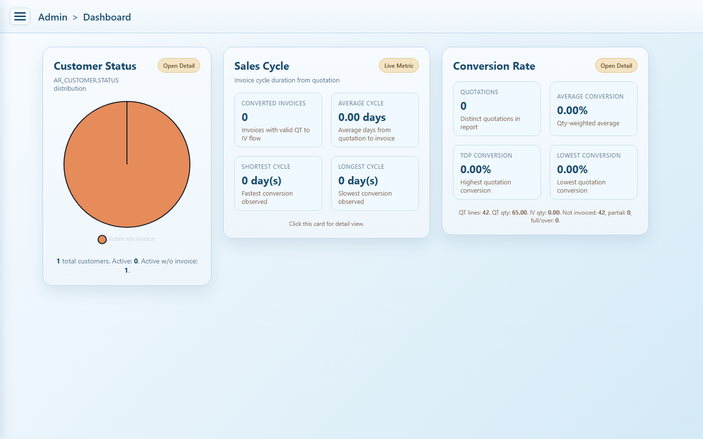

### View quotations

1. Open **Admin > View Quotations**.
2. Filter by status tab (for example **Pending**).
3. Click a quotation to review details and update status.

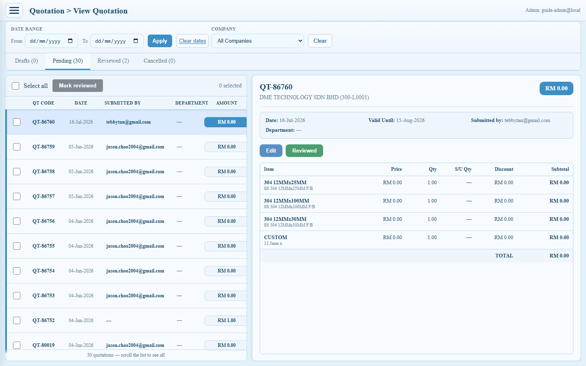

### View purchase requests (e-PR)

1. Open **Admin > Procurement**.
2. Select the **View e-PR** tab.
3. Filter by status (**Draft**, **Approved**, **Pending**, **Cancelled**).
4. Click a purchase request on the left to see lines and description on the right.
5. Update approval status if needed, then click **Update**.

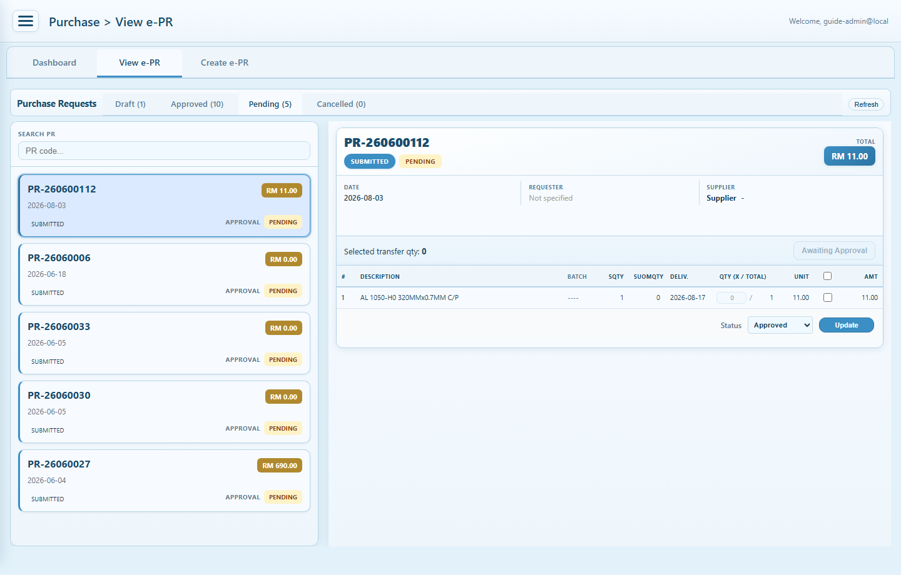

### Create purchase request

1. Open **Admin > Procurement**.
2. Select the **Create e-PR** tab.
3. Enter header details and line items.
4. Save or submit the request.
5. Return to **View e-PR** to track it.

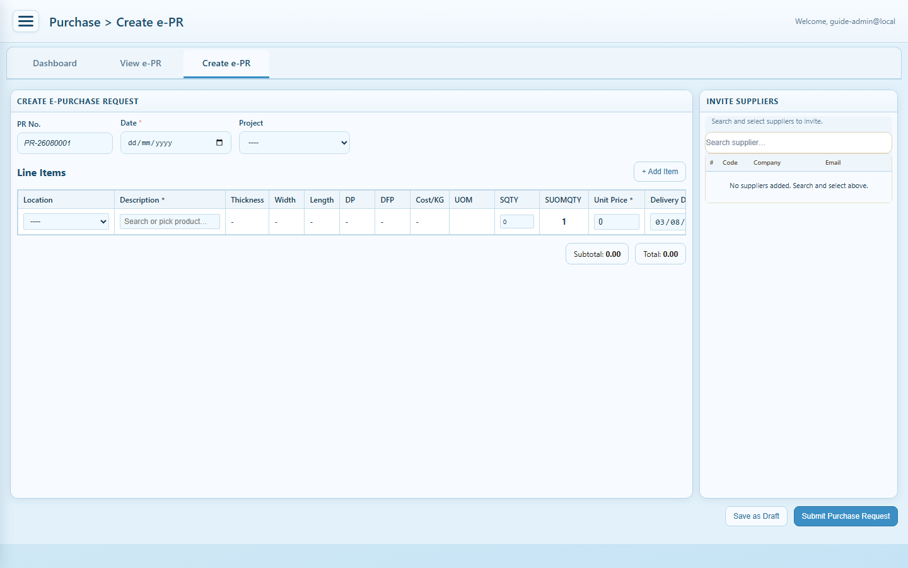

### Supplier bidding (admin)

1. Open **Admin > Procurement > Bidding**.
2. Click a purchase request on the left.
3. Invite suppliers if needed.
4. Review submitted bids in the center panel.
5. Compare totals on the right (**Supplier Cost Comparison**).
6. Award lines and save.

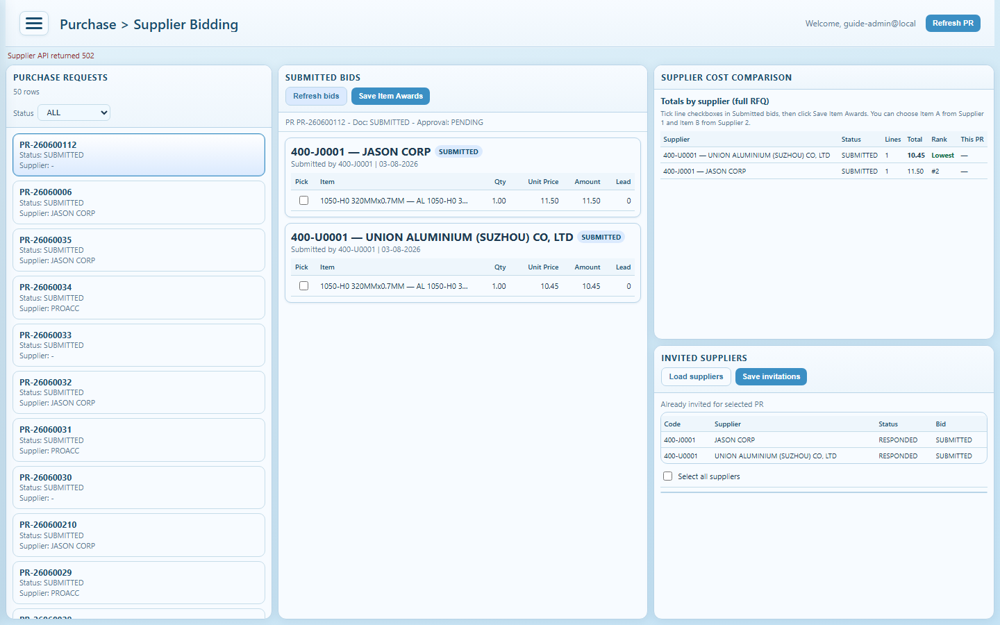

### Pending approvals

1. Open **Admin > Pending Approvals**.
2. Review items waiting for action.
3. Approve, reject, or edit as allowed by your role.

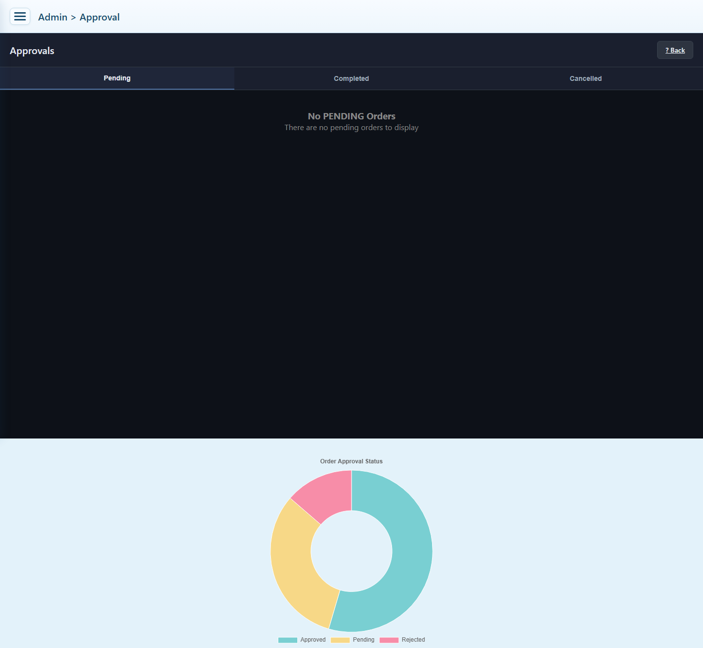

### Invoice aging

1. Open **Admin > Invoice Aging**.
2. Review aging buckets and customer balances.
3. Follow up on overdue amounts as needed.

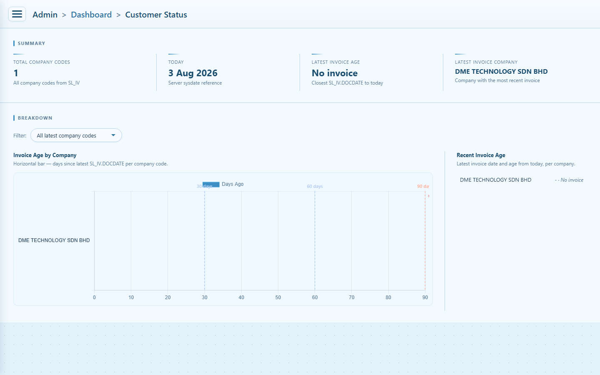

---

## Tips

1. Always pick the correct **Sign in as** type before entering email.
2. If the OTP expires, use **Resend**.
3. After a deploy, hard-refresh with **Ctrl+Shift+R** if the page looks old.
4. If a menu is missing, your role may not include that module — ask an administrator.
